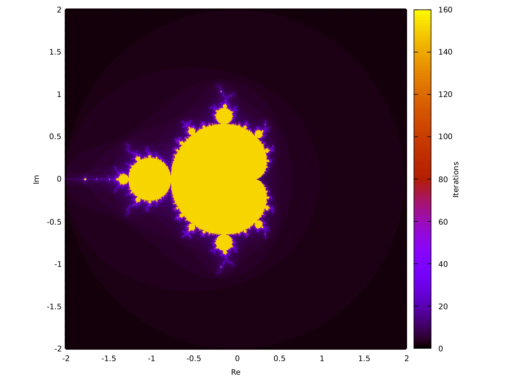

# Mandelbrot-set-in-Fortran-Computation-and-Visualization-with-Gnuplot
Fortran implementation of the Mandelbrot set: point-by-point numerical computation, recording the iteration count until divergence, and scientific visualization with gnuplot using color gradients. A classical example of iterative methods and numerical plotting.

## Mandelbrot Set



## Description

Fortran implementation of the Mandelbrot set. The code computes the iteration count
until divergence for each point in the complex plane and outputs the data for
visualization with gnuplot.

## Requirements

- Fortran compiler (gfortran)
- gnuplot

## Compilation

```bash
F -o mandelbrot mcf_tipos.f90 mandelbrot.f90
